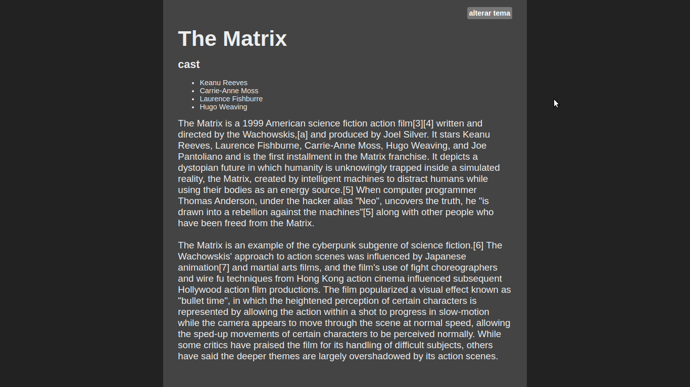

## Dark-mode-theme

 -Aula do professor Lucas Caton no Youtube

 <h4> Um simples dark mode theme </h4>

_______________________________________________________________________________________________

## 🚀 Tecnologias

- HTML
- CSS
- JavaScript

 <h3>## Conceitos colocados em prática</h3>
         <ul>
             <li>Estilização CSS/Flex-box</li>
             <li>Manipulação do DOM</li>
             <li>requisições assíncronas(AJAX)</li>
         </ul>

